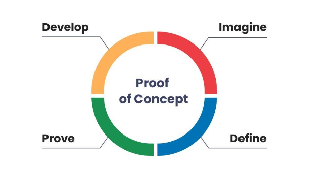

<a id="readme-top"></a>
<!-- PROJECT SHIELDS -->
<!--
*** This file is using markdown "reference style" links for readability.
*** Reference links are enclosed in brackets [ ] instead of parentheses ( ).
*** See the bottom of this document for the declaration of the reference variables
*** for contributors-url, forks-url, etc. This is an optional, concise syntax you may use.
*** https://www.markdownguide.org/basic-syntax/#reference-style-links
-->
[![Contributors][contributors-shield]][contributors-url]
[![Forks][forks-shield]][forks-url]
[![Stargazers][stars-shield]][stars-url]
[![Issues][issues-shield]][issues-url]
[![project_license][license-shield]][license-url]
[![LinkedIn][linkedin-shield]][linkedin-url]


<!-- PROJECT LOGO -->
<br />
<div align="center">
  <a href="https://github.com/MikeLooper/repo_name">
    
  </a>

<h3 align="center">project_title</h3>

  <p align="center">
    project_description
    <br />
    <a href="https://github.com/MikeLooper/repo_name"><strong>Explore the docs »</strong></a>
    <br />
    <br />
    <a href="https://github.com/MikeLooper/repo_name">View Demo</a>
    &middot;
    <a href="https://github.com/MikeLooper/repo_name/issues/new?labels=bug&template=bug-report---.md">Report Bug</a>
    &middot;
    <a href="https://github.com/MikeLooper/repo_name/issues/new?labels=enhancement&template=feature-request---.md">Request Feature</a>
  </p>
</div>


<!-- TABLE OF CONTENTS -->
<details>
  <summary>Table of Contents</summary>
  <ol>
    <li>
      <a href="#about-the-project">About The Project</a>
      <ul>
        <li><a href="#built-with">Built With</a></li>
      </ul>
    </li>
    <li>
      <a href="#getting-started">Getting Started</a>
      <ul>
        <li><a href="#prerequisites">Prerequisites</a></li>
        <li><a href="#installation">Installation</a></li>
      </ul>
    </li>
    <li><a href="#usage">Usage</a></li>
    <li><a href="#roadmap">Roadmap</a></li>
    <li><a href="#contributing">Contributing</a></li>
    <li><a href="#license">License</a></li>
    <li><a href="#contact">Contact</a></li>
    <li><a href="#acknowledgments">Acknowledgments</a></li>
  </ol>
</details>


<!-- ABOUT THE PROJECT -->
## About The Project

A proof of concept API to explore best-practices and new ideas

<p align="right">(<a href="#readme-top">back to top</a>)</p>


### Built With

* [![Bruno][bruno-badge]][bruno-url]
* [![C#][csharp-badge]][csharp-url]
* [![GitHub Copilot][githubcopilot-badge]][githubcopilot-url]
* [![Microsoft SQL Server][mssql-badge]][mssql-url]
* [![OpenAPI][openapi-badge]][openapi-url]
* [![Postgres][postgres-badge]][postgres-url]
* [![Swagger][swagger-badge]][swagger-url]
* [![Visual Studio][visualstudio-badge]][visualstudio-url]

<p align="right">(<a href="#readme-top">back to top</a>)</p>


<!-- GETTING STARTED -->
## Getting Started

This is an example of how you may give instructions on setting up your project locally.
To get a local copy up and running follow these simple example steps.

### Prerequisites

- [Visual Studio 2026](https://visualstudio.microsoft.com/vs/)

### Installation

1. Clone the repo
   ```sh
   git clone https://github.com/MikeLooper/PilotApi.git
   ```
2. Open the .sln file in Visual Studio.

3. Press F5 to build and run the application.

<p align="right">(<a href="#readme-top">back to top</a>)</p>


<!-- USAGE EXAMPLES -->
## Usage

TBD

<p align="right">(<a href="#readme-top">back to top</a>)</p>


<!-- ROADMAP -->
## Roadmap

- [ ] Feature 1
- [ ] Feature 2
- [ ] Feature 3
    - [ ] Nested Feature

See the [open issues](https://github.com/MikeLooper/PilotApi/issues) for a full list of proposed features (and known issues).

<p align="right">(<a href="#readme-top">back to top</a>)</p>


<!-- CONTRIBUTING -->
## Contributing

Contributions are what make the open source community such an amazing place to learn, inspire, and create. Any contributions you make are **greatly appreciated**.

If you have a suggestion that would make this better, please fork the repo and create a pull request. You can also simply open an issue with the tag "enhancement".
Don't forget to give the project a star! Thanks again!

1. Fork the Project
2. Create your Feature Branch (`git checkout -b feature/AmazingFeature`)
3. Commit your Changes (`git commit -m 'Add some AmazingFeature'`)
4. Push to the Branch (`git push origin feature/AmazingFeature`)
5. Open a Pull Request

<p align="right">(<a href="#readme-top">back to top</a>)</p>

### Top contributors:

<a href="https://github.com/MikeLooper/PilotApi/graphs/contributors">
  
</a>


<!-- LICENSE -->
## License

Distributed under the MIT License. See `LICENSE.txt` for more information.

<p align="right">(<a href="#readme-top">back to top</a>)</p>


<!-- CONTACT -->
## Contact

Michael Looper - MikelLooper@gmail.com

Project Link: [https://github.com/MikeLooper/PilotApi](https://github.com/MikeLooper/PilotApi)

<p align="right">(<a href="#readme-top">back to top</a>)</p>


<!-- ACKNOWLEDGMENTS -->
## Acknowledgments

* []()
* []()
* []()

<p align="right">(<a href="#readme-top">back to top</a>)</p>


<!-- MARKDOWN LINKS & IMAGES -->
<!-- https://www.markdownguide.org/basic-syntax/#reference-style-links -->
[contributors-shield]: https://img.shields.io/github/contributors/MikeLooper/PilotApi.svg?style=for-the-badge
[contributors-url]: https://github.com/MikeLooper/PilotApi/graphs/contributors
[forks-shield]: https://img.shields.io/github/forks/MikeLooper/PilotApi.svg?style=for-the-badge
[forks-url]: https://github.com/MikeLooper/PilotApi/network/members
[stars-shield]: https://img.shields.io/github/stars/MikeLooper/PilotApi.svg?style=for-the-badge
[stars-url]: https://github.com/MikeLooper/PilotApi/stargazers
[issues-shield]: https://img.shields.io/github/issues/MikeLooper/PilotApi.svg?style=for-the-badge
[issues-url]: https://github.com/MikeLooper/PilotApi/issues
[license-shield]: https://img.shields.io/github/license/MikeLooper/PilotApi.svg?style=for-the-badge
[license-url]: https://github.com/MikeLooper/PilotApi/blob/master/LICENSE.txt
[linkedin-shield]: https://img.shields.io/badge/-LinkedIn-black.svg?style=for-the-badge&logo=linkedin&colorB=555
[linkedin-url]: https://linkedin.com/in/michaellooper
[product-screenshot]: images/screenshot.png
<!-- Shields.io badges. You can a comprehensive list with many more badges at: https://github.com/inttter/md-badges -->
[bruno-badge]: https://img.shields.io/badge/Bruno-F4AA41?logo=Bruno&logoColor=black
[bruno-url]: https://www.usebruno.com/
[csharp-badge]: https://custom-icon-badges.demolab.com/badge/C%23-%23239120.svg?logo=cshrp&logoColor=white
[csharp-url]: https://learn.microsoft.com/en-us/dotnet/csharp/
[githubcopilot-badge]: https://img.shields.io/badge/GitHub%20Copilot-000?logo=githubcopilot&logoColor=fff
[githubcopilot-url]: https://github.com/copilot
[mssql-badge]: https://custom-icon-badges.demolab.com/badge/Microsoft%20SQL%20Server-CC2927?logo=mssqlserver-white&logoColor=white
[mssql-url]: https://www.microsoft.com/en-us/sql-server
[openapi-badge]: https://img.shields.io/badge/OpenAPI-6BA539?logo=openapiinitiative&logoColor=white
[openapi-url]: https://www.openapis.org/
[postgres-badge]: https://img.shields.io/badge/Postgres-%23316192.svg?logo=postgresql&logoColor=white
[postgres-url]: https://www.postgresql.org/
[swagger-badge]: https://img.shields.io/badge/Swagger-85EA2D?logo=swagger&logoColor=173647
[swagger-url]: https://swagger.io/
[visualstudio-badge]: https://custom-icon-badges.demolab.com/badge/Visual%20Studio-5C2D91.svg?&logo=visualstudio&logoColor=white
[visualstudio-url]: https://visualstudio.microsoft.com/
